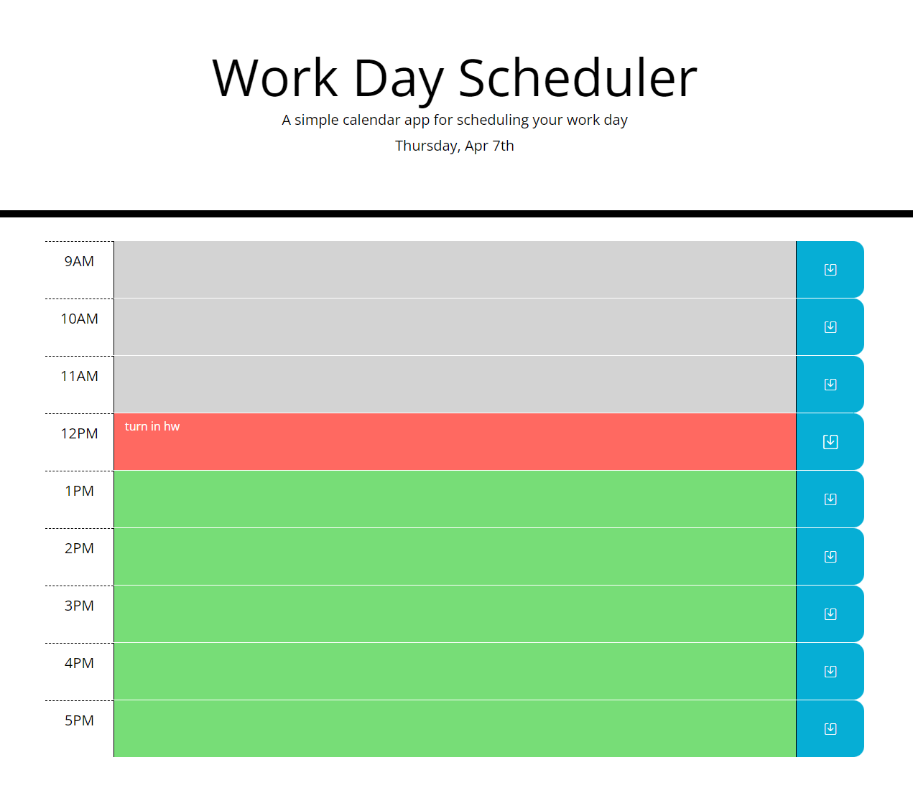

# work-day-scheduler
# Chuan Wang
# Week3 Unit5 HW5
A simple day scheduler.  
The time on the titles uses moment.js to get current time.  
The textarea color will change based on time, present = light red, past = light gray, future = light green.  
When clicking on text fields you can enter tasks.  
When SAVE button is clicked the task will be saved to localstorage and won't be lost on refresh.  
Screen shot to show what site looks like:  

 
Link to deployed site:  
https://chuanw101.github.io/work-day-scheduler/